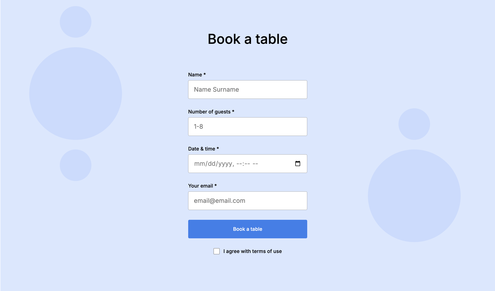

# Triple Peaks Coffee Shop

A static website built with Semantic HTML5, Flexbox, and Positioning for a well-structured layout. It follows a Flat BEM file structure, includes a custom form, and features CSS animations and transforms for an engaging user experience.



## Description

This project showcases a modern and responsive design for a coffee shop's website. It provides information about the shop, displays featured coffee recipes, and includes a reservation form for customers to book a table.

## Features

- **Semantic HTML5:** Ensures the website is accessible and SEO-friendly.
- **Flexbox Layout:** Provides a flexible and responsive design that adapts to various screen sizes.
- **Flat BEM File Structure:** Organizes CSS for better maintainability and scalability.
- **Custom Form:** Allows users to make reservations directly from the website.
- **CSS Animations and Transforms:** Enhances user engagement with interactive elements.


## Live Demo

Experience the live version of the project here: [Triple Peaks Coffee Shop Live Demo](https://sawsimonlinn.github.io/se_project_coffeeshop/)

## Demo Video

For a comprehensive walkthrough of the website's features, watch the demo video:

[](https://example.com/demo-video.mp4)

## Deployment and System Requirements

As this is a static website, you can run it locally or deploy it to any web server without specific system requirements.

**Deployment Instructions:**

1. **Clone the repository:**

   ```bash
   git clone https://github.com/SawSimonLinn/se_project_coffeeshop.git
   cd se_project_coffeeshop
   ```

2. **Open the website:**

Simply open the `index.html` file in your preferred web browser.
